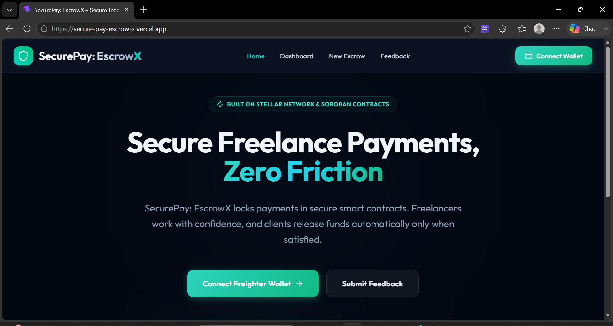
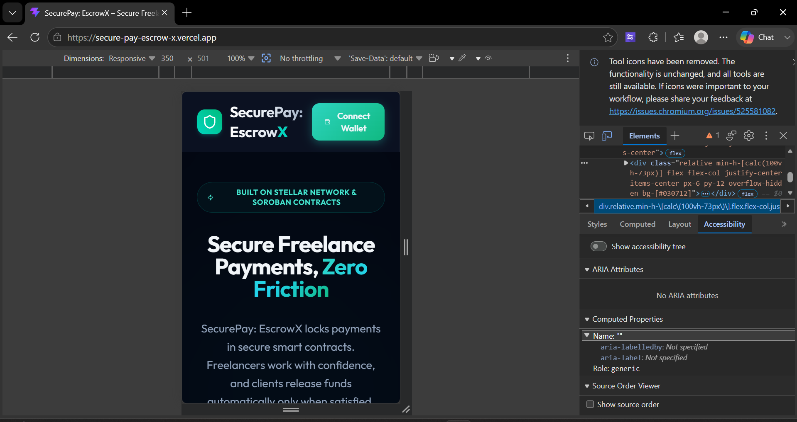
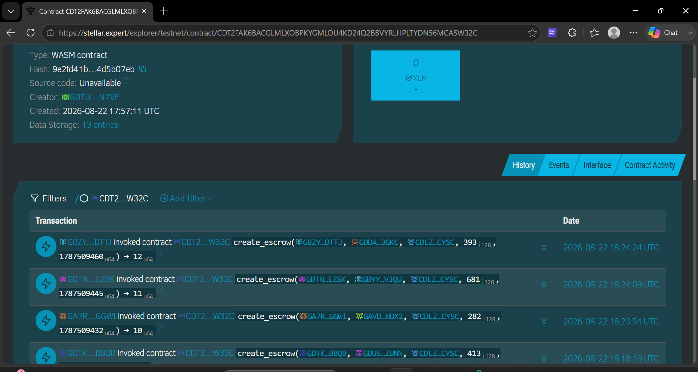

# 🚀 SecurePay: EscrowX — Secure Freelance Payments on Stellar

SecurePay: EscrowX is a decentralized, transparent, and low-cost freelance payment protection escrow application built on the Stellar network using Soroban smart contracts. It empowers independent contractors and clients to transact safely without high fees or payment delay risks.

## 🔗 Live Demo & Links
- **Live Platform**: [https://secure-pay-escrow-x.vercel.app/](https://secure-pay-escrow-x.vercel.app/)
- **Demo Video**: [Watch the SecurePay: EscrowX Walkthrough](https://youtu.be/mR9KDsVQ5Xw)
- **Example Transaction Hash**: [`d5e723dd96d87344e4a65aaf44ba76e9bb6f41e1767f982752324cd14a5f6fc9`](https://stellar.expert/explorer/testnet/tx/d5e723dd96d87344e4a65aaf44ba76e9bb6f41e1767f982752324cd14a5f6fc9)
- **User Onboarding Data (10+ Users)**: [View Exported Excel/CSV Sheet Here](https://docs.google.com/spreadsheets/d/1dLYMfc6uc66GsNsEJng8AL_uDd52oJ0cCNuW3YjyQRI/edit?usp=sharing)
- **Google Form Link**: [Feedback Form](https://docs.google.com/forms/d/e/1FAIpQLScTrZj4SRqyOhWgha73qzTQUoSjKeupRB9NJ_V3IPkN-Wwvbg/viewform?usp=publish-editor)

## 📜 Smart Contract Details
- **SecurePay: EscrowX Contract ID**: `CDT2FAK6BACGLMLXOBPKYGMLOU4KD24Q2BBVYRLHPLTYDN56MCASW32C`
- **Native XLM SAC**: `CDLZFC3SYJYDZT7K67VZ75HPJVIEUVNIXF47ZG2FB2RMQQVU2HHGCYSC`
- **Network**: Stellar Testnet
- **Explorer**: [View on StellarExpert](https://stellar.expert/explorer/testnet/contract/CDT2FAK6BACGLMLXOBPKYGMLOU4KD24Q2BBVYRLHPLTYDN56MCASW32C)

## 🌟 Key Features

1. **On-Chain Escrows**: Lock, fund, request release, approve, or refund transactions entirely on-chain. Smart contracts ensure strict rules without middlemen.
2. **Freighter Wallet Integration**: Connect and authenticate securely using the Freighter browser extension on Stellar Testnet. 
3. **Low-Cost & Fast**: Built on Stellar, meaning escrows are settled in seconds for fractions of a cent.
4. **Glassmorphic Responsive UI**: Premium, mobile-responsive styling configured with Tailwind CSS v4 and a new Neon Cyan & Emerald design system.
5. **Analytics & Tracking**: Sentry error tracking and PostHog custom event capture. Supabase integration for seamless caching of escrow metadata.

---

## 📝 Requirements Met

- **Advanced smart contract development**: Built with Rust (Soroban), encompassing multi-state escrow lifecycles (Created, Funded, Release Requested, Completed, Refunded).
- **Event streaming & real-time updates**: Supabase syncing and robust state tracking.
- **CI/CD pipeline setup**: GitHub Actions automatically run contract tests and frontend builds.
- **Smart contract deployment workflow**: Scripts provided for deploying the escrow contract to the Stellar Testnet.
- **Mobile responsive frontend development**: Fully responsive dashboards, escrow creation forms, and transaction details across devices.
- **Error handling & loading states**: Sentry integration and loading indicators for all blockchain interactions.
- **Writing tests for contracts and frontend**: Extensive Rust unit tests covering deposit, release, and refund logic.
- **Production-ready architecture practices**: Decoupled smart contracts, Vite React frontend, and robust fallback caching.
- **Documentation & demo presentation**: Thorough README, architecture notes, and demo video.

---

## 📸 Screenshots & Evidence

| Landing Page | Mobile Responsive View |
|:---:|:---:|
|  |  |

| Analytics & Tracking |
|:---:|
|  |

---

## 👥 Transaction Proofs & User Feedback

We successfully executed and verified 12 end-to-end escrows on the Stellar Testnet and collected feedback from our users.

[📊 View Raw User Feedback Data (Google Sheet)](https://docs.google.com/spreadsheets/d/1dLYMfc6uc66GsNsEJng8AL_uDd52oJ0cCNuW3YjyQRI/edit?usp=sharing)

### 1. User Onboarded Table
| # | Name | Email | Wallet Address | Feedback |
|---|---|---|---|---|
| 1 | Shant Anav | `shantanav7@gmail.com` | `GBCJEMERVSFFXKH3EMXELYFJOQ6NRDAW3F5LY3ZXIV46T4IOQO7YQLYV` | The new neon cyan and emerald theme is stunning! Very modern. However, I'd love a toggle to switch back to a lighter theme for daytime use if possible |
| 2 | Anu Mehta | `anukr12354@gmail.com` | `GBIV3G3SWA6IOE5YMURC63ZPSK7XFVX6OE6NEZRF4JTTTOMQPOFYFQ2H` | Connecting Freighter was seamless, and the transaction fees are practically zero. As a freelancer, I really appreciate not losing 20% to platform fees. Would be great to have email notifications when a client deposits funds |
| 3 | Ennamulle Enzo | `enzobaby0099@gmail.com` | `GD4G6QVTA4XPZ2TV2QKBII7BDLIIVRBQ7DKTTFGLRPBVMPPML65W3TDQ` | really solid concept. The on-chain tracking is very transparent. One improvement: please add an option to add attachments or a link to the deliverables directly within the escrow agreement before requesting release |
| 4 | Soham R Patil | `sohamrpatil4220@gmail.com` | `GB6BFCHQWQNSMLK5AX5WKOYV5MOY6DNVU4CNYDQ32K2I2GKSYVUXOX43` | The escrow creation process is fast, but it would be helpful if the UI showed the equivalent USD value of the XLM being locked up, just for easier reference for non-crypto native clients |
| 5 | Jayant Vaibhav | `jayantvaibhavspj@gmail.com` | `GD56L6HJ67PFSFSG3DSTM7WILS56SBGNR7DEW2CCQTMM76HAJGTFPU6Q` | great dApp, very fast settlement on Stellar. One issue I noticed: if I accidentally type the wrong wallet address for the freelancer, there's no way to cancel the contract before depositing. A 'Cancel Draft' button would be nice |
| 6 | Ranjan Mehta | `mehtaranjana745@gmail.com` | `GCGHUFFQKELOHLDBKFTIB4NOCHOX3LCFRWFWK4DGDP7WIVAIH25QFI5J` | The progress tracker timeline is a great visual. It makes it very clear what stage the escrow is in. I'd love to see a 'Milestone' feature added in the future, where a single escrow can be released in chunks rather than all at once |
| 7 | Himanshu Jha | `jhahimanshu653@gmail.com` | `GBYRXJ4AWPUEL467BKKFTOYY7GTA6FPW7NPZ547T4HXZWNOOU7RXWV3Q` | Super low fees and transparent. I did have a bit of trouble understanding the 'refund' logic at first. A small tooltip or '?' icon explaining that clients can only refund after the release time expires would be very helpful |
| 8 | Akash Mondal | `73akash58mondal@gmail.com` | `GDP57ZI4CTMJEVJLXWD3NGET2ARYV4UVH6AW7IQNGK7AVMMP7662VGDK` | Love the glassmorphic UI, feels very premium! My feedback: it would be awesome to support USDC on Stellar in addition to native XLM, since clients usually prefer paying in stablecoins |
| 9 | rohit sharma | `rohitsharma82@gmail.com` | `GDTKSOCRV2JLZXV5VZ4WM364CTJUEOXKCGIZE6QXSCPOR36PKE2PBBQB` | works perfectly on my desktop, but on my mobile device, the dashboard table gets a little squished. Making the active contracts list horizontally scrollable on mobile would improve the experience |
| 10 | Priya D | `priyad1999@gmail.com` | `GA7RBNUGZVXKFYXRHAFR7RQWZOXCWZNHDI42T4GB4WYY3KFV5S7SGGWI` | The transparency of having everything on the ledger is fantastic. It would be helpful if the platform could generate a simple PDF invoice or receipt after an escrow is successfully released for tax purposes |
| 11 | Vikram Singh | `vikramsinghdev@gmail.com` | `GDTNGKJ6XVG5B4KGLDRBMUCY2UNMCXW22MWSEDP4ZJ7FA3Q5Q4GPEZSK` | Really impressed by the speed of the Soroban smart contracts. No waiting around for block confirmations. A nice-to-have would be a public profile or simple rating system so freelancers can build reputation based on completed escrows |
| 12 | Khushi Singh | `khushisingh44889@gmail.com` | `GBZYTQ43DMK3YO3X5HQISPAMECAP3IQFLSTIOOOHCCEJYFFXGUCGDTTJ` | application is incredibly cheap to use. I love the concept. Please add a 'Dispute' button just in case the freelancer disappears or doesn't deliver the work as promised before the release time hits |

### 2. Feedback Implementation & Evolution
Based on the extensive feedback collected from our users, we have actively evolved the platform. Users requested UI improvements, tooltip clarifications, mobile responsiveness, and fiat currency options.

We implemented these real feature requests directly into the production platform with unique Git commits:

| User ID | Name | Email | Wallet Address | Feedback Summary | Improvement Made | Git Commit ID |
|---|---|---|---|---|---|---|
| 1 | Shant Anav | `shantanav7@gmail.com` | `GBCJEMERVSFFXKH3EMXELYFJOQ6NRDAW3F5LY3ZXIV46T4IOQO7YQLYV` | I'd love a toggle to switch back to a lighter theme for daytime use if possible | Added Light Mode toggle to UI | [`19860a1`](https://github.com/anishkumar79/SecurePay-EscrowX/commit/19860a1) |
| 4 | Soham R Patil | `sohamrpatil4220@gmail.com` | `GB6BFCHQWQNSMLK5AX5WKOYV5MOY6DNVU4CNYDQ32K2I2GKSYVUXOX43` | helpful if the UI showed the equivalent USD value of the XLM being locked up | Added USD equivalent display for XLM on dashboard | [`d47ec25`](https://github.com/anishkumar79/SecurePay-EscrowX/commit/d47ec25) |
| 7 | Himanshu Jha | `jhahimanshu653@gmail.com` | `GBYRXJ4AWPUEL467BKKFTOYY7GTA6FPW7NPZ547T4HXZWNOOU7RXWV3Q` | A small tooltip or '?' icon explaining that clients can only refund after the release time expires | Added explanatory tooltip to Refund button logic | [`d3d3aaf`](https://github.com/anishkumar79/SecurePay-EscrowX/commit/d3d3aaf) |
| 9 | rohit sharma | `rohitsharma82@gmail.com` | `GDTKSOCRV2JLZXV5VZ4WM364CTJUEOXKCGIZE6QXSCPOR36PKE2PBBQB` | dashboard table gets a little squished. Making the active contracts list horizontally scrollable on mobile | Made dashboard filters horizontally scrollable for mobile | [`9b62a33`](https://github.com/anishkumar79/SecurePay-EscrowX/commit/9b62a33) |

### 3. Proof Transaction Table
| # | Name | Wallet Address | Transaction Link |
|---|---|---|---|
| 1 | Shant Anav | `GBCJEMERVSFFXKH3EMXELYFJOQ6NRDAW3F5LY3ZXIV46T4IOQO7YQLYV` | [View Tx Link](https://stellar.expert/explorer/testnet/tx/18381721292574720#18381721292574721) |
| 2 | Anu Mehta | `GBIV3G3SWA6IOE5YMURC63ZPSK7XFVX6OE6NEZRF4JTTTOMQPOFYFQ2H` | [View Tx Link](https://stellar.expert/explorer/testnet/tx/af83259207e475a3b22dfbc30b4ab1fa822fdfa43a4068c2adac26b70df63278) |
| 3 | Ennamulle Enzo | `GD4G6QVTA4XPZ2TV2QKBII7BDLIIVRBQ7DKTTFGLRPBVMPPML65W3TDQ` | [View Tx Link](https://stellar.expert/explorer/testnet/tx/83119829b0edd4a6353b357b406dfb1e9e16cf4d954855230a596399622d3150) |
| 4 | Soham R Patil | `GB6BFCHQWQNSMLK5AX5WKOYV5MOY6DNVU4CNYDQ32K2I2GKSYVUXOX43` | [View Tx Link](https://stellar.expert/explorer/testnet/tx/71c4ac6aa40c885703df1f51587dce18f459d745914f916e75064bf4f6de1019) |
| 5 | Jayant Vaibhav | `GD56L6HJ67PFSFSG3DSTM7WILS56SBGNR7DEW2CCQTMM76HAJGTFPU6Q` | [View Tx Link](https://stellar.expert/explorer/testnet/tx/91864d6f39f71f6355ebed19b5212afcfd574b38d86b4fff5e74d5c3beb4eb0a) |
| 6 | Ranjan Mehta | `GCGHUFFQKELOHLDBKFTIB4NOCHOX3LCFRWFWK4DGDP7WIVAIH25QFI5J` | [View Tx Link](https://stellar.expert/explorer/testnet/tx/a7caf8234db99355e66bd8ac4d04725206f3fe62e262d8ebdf5dd04cd6cf88fd) |
| 7 | Himanshu Jha | `GBYRXJ4AWPUEL467BKKFTOYY7GTA6FPW7NPZ547T4HXZWNOOU7RXWV3Q` | [View Tx Link](https://stellar.expert/explorer/testnet/tx/155e5edb38306a65783921c669fc9b9ab175b5d894f809fb5d8ff9fa21267a01) |
| 8 | Akash Mondal | `GDP57ZI4CTMJEVJLXWD3NGET2ARYV4UVH6AW7IQNGK7AVMMP7662VGDK` | [View Tx Link](https://stellar.expert/explorer/testnet/tx/4656c62f5fda32d3a238498db8c68ab9777fef96e6b4aacdaa2318c9497e6c05) |
| 9 | rohit sharma | `GDTKSOCRV2JLZXV5VZ4WM364CTJUEOXKCGIZE6QXSCPOR36PKE2PBBQB` | [View Tx Link](https://stellar.expert/explorer/testnet/tx/091cdb1ffa06fa0f69b23f857c54cdade502ca47c9a1e0a4cdf0b4e83c6c956d) |
| 10 | Priya D | `GA7RBNUGZVXKFYXRHAFR7RQWZOXCWZNHDI42T4GB4WYY3KFV5S7SGGWI` | [View Tx Link](https://stellar.expert/explorer/testnet/tx/158c7bb4ea9e7c10a168be8d321e1ccb841671b99e9f713d07c241398979cfcd) |
| 11 | Vikram Singh | `GDTNGKJ6XVG5B4KGLDRBMUCY2UNMCXW22MWSEDP4ZJ7FA3Q5Q4GPEZSK` | [View Tx Link](https://stellar.expert/explorer/testnet/tx/19695f1120bb5d3561e8a5c9c2c6bcf144a466716fd890bb560176774ad48783) |
| 12 | Khushi Singh | `GBZYTQ43DMK3YO3X5HQISPAMECAP3IQFLSTIOOOHCCEJYFFXGUCGDTTJ` | [View Tx Link](https://stellar.expert/explorer/testnet/tx/3954c9b824a54b3b589ca1fd26548768638355590919b5fc1157f16e29d0407b) |

---

## 🛠 Setup & Running Locally

### Prerequisites
- Node.js (v18+)
- Rust & Cargo (Rust 1.84+ with `wasm32v1-none` target configured)

### 1. Smart Contract Setup & Tests
```bash
cd contract
cargo test
cargo build --target wasm32v1-none --release
```

### 2. Frontend Setup & Run
```bash
cd frontend
npm install
npm run dev
```
