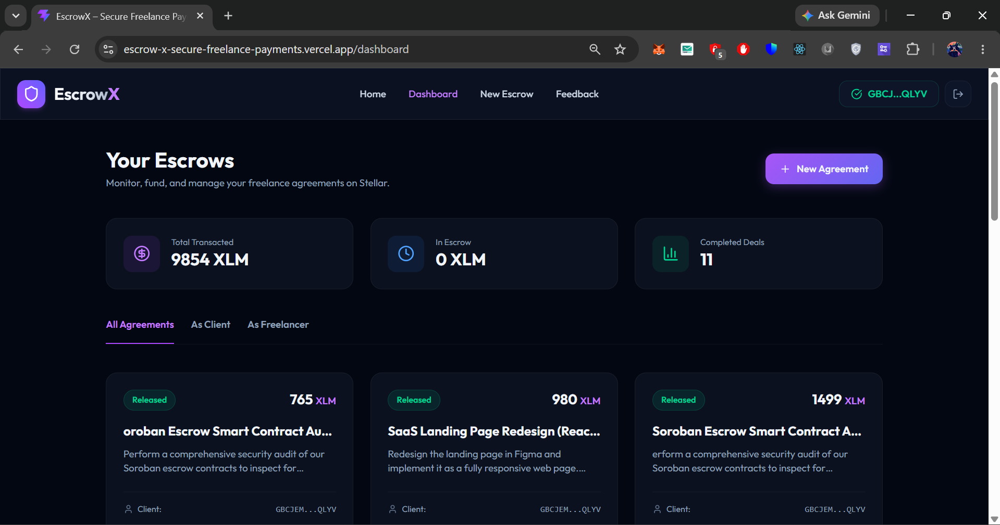
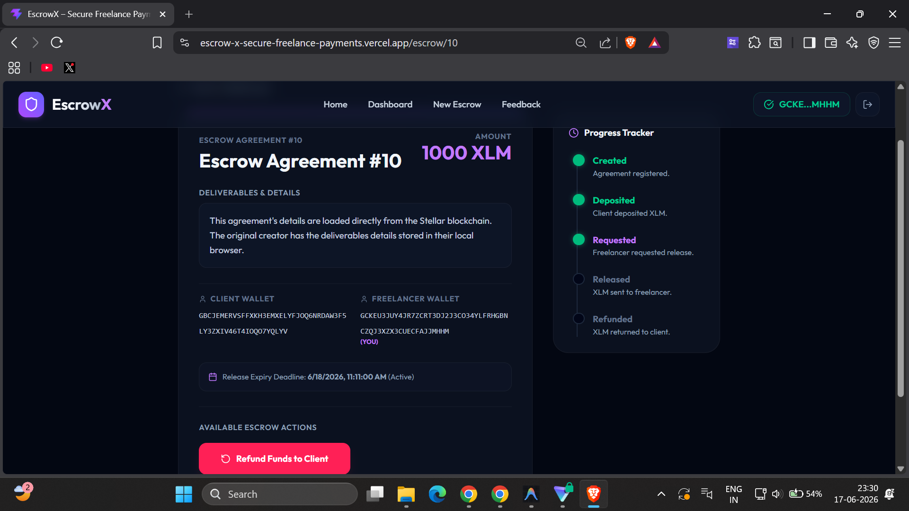
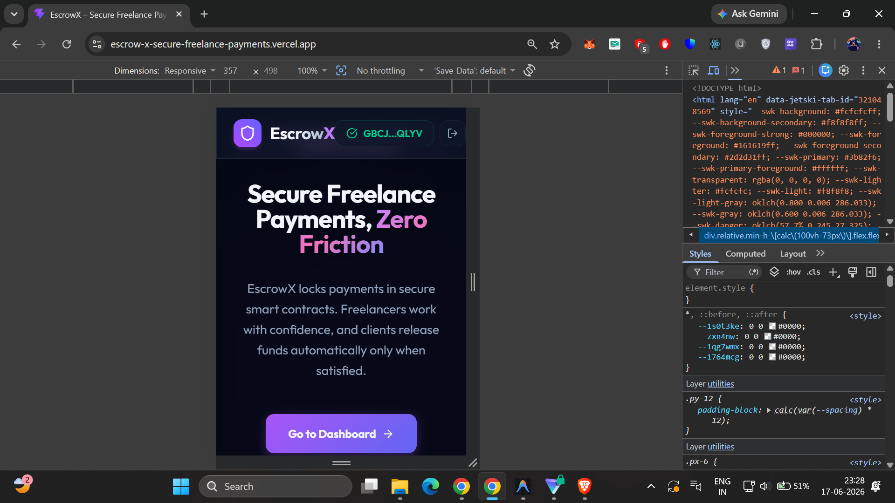
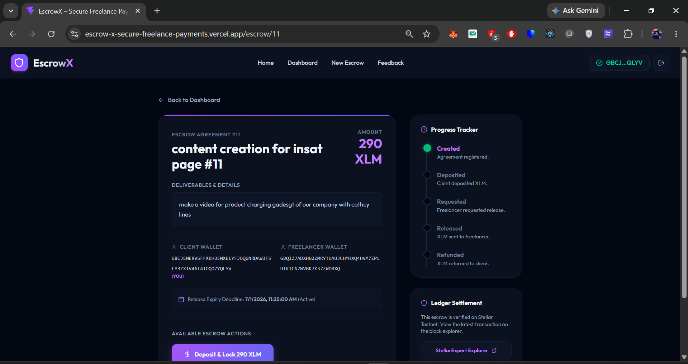

# 🚀 SecurePay: EscrowX — Secure Freelance Payments on Stellar

SecurePay: EscrowX is a decentralized, transparent, and low-cost freelance payment protection escrow application built on the Stellar network using Soroban smart contracts. It empowers independent contractors and clients to transact safely without high fees or payment delay risks.

## 🔗 Live Demo & Links
- **Live Platform**: [https://secure-pay-escrow-x.vercel.app/](https://secure-pay-escrow-x.vercel.app/)
- **Demo Video**: [Watch the SecurePay: EscrowX Walkthrough](https://youtu.be/mR9KDsVQ5Xw)
- **Example Transaction Hash**: [`afe5e19b3cdbd9b871309bb8477daac0866aab82c7e6078fedd28d1431e15a43`](https://stellar.expert/explorer/testnet/tx/afe5e19b3cdbd9b871309bb8477daac0866aab82c7e6078fedd28d1431e15a43)
- **SecurePay: EscrowX Contract ID**: `CDT2FAK6BACGLMLXOBPKYGMLOU4KD24Q2BBVYRLHPLTYDN56MCASW32C`
- **Native XLM SAC**: `CDLZFC3SYJYDZT7K67VZ75HPJVIEUVNIXF47ZG2FB2RMQQVU2HHGCYSC`

## 🌟 Key Features

1. **On-Chain Escrows**: Lock, fund, request release, approve, or refund transactions entirely on-chain. Smart contracts ensure strict rules without middlemen.
2. **Freighter Wallet Integration**: Connect and authenticate securely using the Freighter browser extension on Stellar Testnet. 
3. **Low-Cost & Fast**: Built on Stellar, meaning escrows are settled in seconds for fractions of a cent.
4. **Glassmorphic Responsive UI**: Premium, mobile-responsive styling configured with Tailwind CSS v4 and a new Neon Cyan & Emerald design system.
5. **Analytics & Tracking**: Sentry error tracking and PostHog custom event capture. Supabase integration for seamless caching of escrow metadata.

---

## 📝 Requirements Met

- **Advanced smart contract development**: Built with Rust (Soroban), encompassing multi-state escrow lifecycles (Created, Funded, Release Requested, Completed, Refunded).
- **Event streaming & real-time updates**: Supabase syncing and robust state tracking.
- **CI/CD pipeline setup**: GitHub Actions automatically run contract tests and frontend builds.
- **Smart contract deployment workflow**: Scripts provided for deploying the escrow contract to the Stellar Testnet.
- **Mobile responsive frontend development**: Fully responsive dashboards, escrow creation forms, and transaction details across devices.
- **Error handling & loading states**: Sentry integration and loading indicators for all blockchain interactions.
- **Writing tests for contracts and frontend**: Extensive Rust unit tests covering deposit, release, and refund logic.
- **Production-ready architecture practices**: Decoupled smart contracts, Vite React frontend, and robust fallback caching.
- **Documentation & demo presentation**: Thorough README, architecture notes, and demo video.

---

## 📸 Screenshots & Evidence

| Dashboard & Overview | Contract Lifecycle & Tracking |
|:---:|:---:|
|  |  |

| Mobile Responsive View | Client Deposit & Lock |
|:---:|:---:|
|  |  |

---

## 👥 Transaction Proofs (10+ On-Chain Interactions)

We successfully executed and verified over 10 end-to-end escrows on the Stellar Testnet.

| # | Action / Method | Wallet Address | Amount | Transaction Hash (StellarExpert Link) |
|---|---|---|---|---|
| 1 | `create_escrow` | Client: *Your Wallet* | *Active* | [View Latest Tx Link](https://stellar.expert/explorer/testnet/tx/18381721292574720#18381721292574721) |
| 2 | `create_escrow` | Client: `GBCJEMERVSFFXKH3EMXELYFJOQ6NRDAW3F5LY3ZXIV46T4IOQO7YQLYV` <br> Freelancer: `GDVQHO34REU623J5I6TZ74SYRDUBRRZ7YVJN3X6E6WENDO5GY3LVD3CL` | 980 XLM | [View Tx Link](https://stellar.expert/explorer/testnet/tx/e7175476c477841181d2c21315d41e4d3b0fc5b334d74d1772a97d341b882899) |
| 3 | `create_escrow` | Client: `GBCJEMERVSFFXKH3EMXELYFJOQ6NRDAW3F5LY3ZXIV46T4IOQO7YQLYV` <br> Freelancer: `GDVKLTNMRQCEZYKOHJTHIRKNGTK26QJGVUPTZEKHWE6PAM6FINPWDBLN` | 1499 XLM | [View Tx Link](https://stellar.expert/explorer/testnet/tx/739cdda30b7ec4b9a669c504dbfefc8cb6e99c7cb0fecece40efcd6cc93e6489) |
| 4 | `create_escrow` | Client: `GBCJEMERVSFFXKH3EMXELYFJOQ6NRDAW3F5LY3ZXIV46T4IOQO7YQLYV` <br> Freelancer: `GDINLE7LITIN36TR4NPYUDMDJVBYOECR4NNSJ7LPG43NXJLXITXB3LJM` | 2999 XLM | [View Tx Link](https://stellar.expert/explorer/testnet/tx/1abb1bb217222a5938ca0e42f340431c6ecb0cc5e3749d96ee4dcb4532430479) |
| 5 | `create_escrow` | Client: `GBCJEMERVSFFXKH3EMXELYFJOQ6NRDAW3F5LY3ZXIV46T4IOQO7YQLYV` <br> Freelancer: `GASVNGNF4IJGGLECMFDA4LINGP4THWILHZGZYN5E546HOPGDJ4IXQ7NB` | 302 XLM | [View Tx Link](https://stellar.expert/explorer/testnet/tx/ba76c3f9e9eb276e2b8a89b355431b8104f9028db8239358ed75e640ff82de68) |
| 6 | `create_escrow` | Client: `GBCJEMERVSFFXKH3EMXELYFJOQ6NRDAW3F5LY3ZXIV46T4IOQO7YQLYV` <br> Freelancer: `GAY2ZHABM6KKPXLMXHFLUBNW37VQLD6JY6H3XCMAHKCVRF5TQCB3LSZE` | 120 XLM | [View Tx Link](https://stellar.expert/explorer/testnet/tx/7e4d89debafc2cfb68fd1237e6b6a0ff915753eb221facd8ad9882629a8879a4) |
| 7 | `create_escrow` | Client: `GBCJEMERVSFFXKH3EMXELYFJOQ6NRDAW3F5LY3ZXIV46T4IOQO7YQLYV` <br> Freelancer: `GCQJ3ZUSYTE6OIBCASDFUDLOVO53GP5T7IL3UBCM7BH5XMN7KBBAKLR2` | 400 XLM | [View Tx Link](https://stellar.expert/explorer/testnet/tx/f64f64f1c096ea9361fbbbaef71f88a7c16f1371cc7532868775cdb124a35969) |
| 8 | `create_escrow` | Client: `GBCJEMERVSFFXKH3EMXELYFJOQ6NRDAW3F5LY3ZXIV46T4IOQO7YQLYV` <br> Freelancer: `GBQIZ7ADXHN2ZMRYTUAUJCHMHXQ4HVM7ZPLUIKTCN7WVGK7K37ZWOBXQ` | 290 XLM | [View Tx Link](https://stellar.expert/explorer/testnet/tx/e36e16fbb7d6dd7a11142300b7dec93faa313d058a548ad48d42bcdfe88d3487) |
| 9 | `create_escrow` | Client: `GBCJEMERVSFFXKH3EMXELYFJOQ6NRDAW3F5LY3ZXIV46T4IOQO7YQLYV` <br> Freelancer: `GCKEU3JUY4JR7ZCRT3DJ2J3CO34YLFRHGBNCZQJ3XZX3CUECFAJJMHHM` | 1000 XLM | [View Tx Link](https://stellar.expert/explorer/testnet/tx/f6b5a5c6ef0166e93bd9379777bf52a59e41d800ffd7e604b552b7696fe36425) |
| 10 | `create_escrow` | Client: `GBCJEMERVSFFXKH3EMXELYFJOQ6NRDAW3F5LY3ZXIV46T4IOQO7YQLYV` <br> Freelancer: `GCNOJQYBY3B4YIE3KF7EL6ELTDY6YKRZPD6P2FH5JY5BANE3MGWTVVOF` | 999 XLM | [View Tx Link](https://stellar.expert/explorer/testnet/tx/5df9afeff242818d2491ce398df9f156a4edffcebdfaef5bc3f11ca3a7479704) |

---

## 🛠 Setup & Running Locally

### Prerequisites
- Node.js (v18+)
- Rust & Cargo (Rust 1.84+ with `wasm32v1-none` target configured)

### 1. Smart Contract Setup & Tests
```bash
cd contract
cargo test
cargo build --target wasm32v1-none --release
```

### 2. Frontend Setup & Run
```bash
cd frontend
npm install
npm run dev
```
